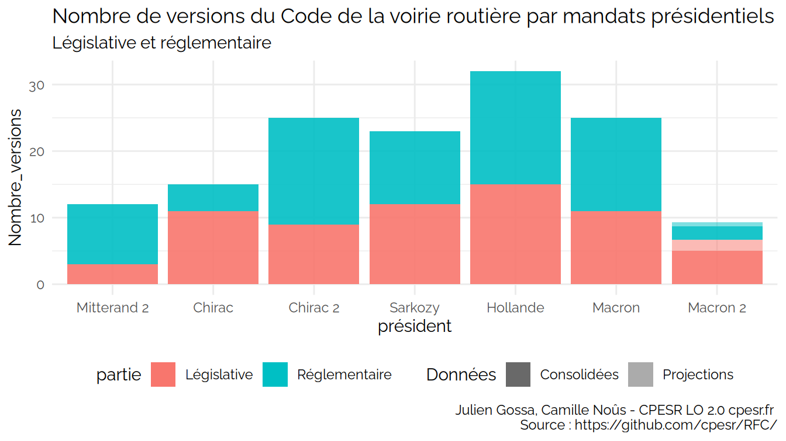
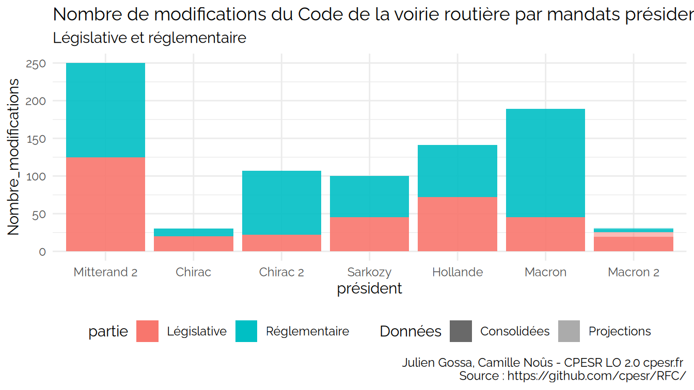
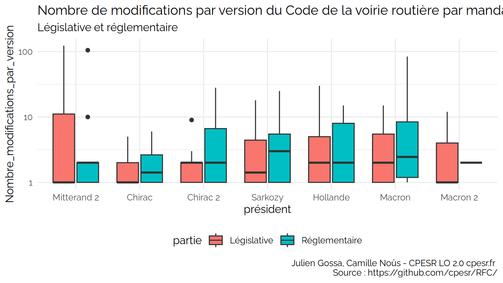

CPESR
================
CPESR
2025-10-01

## Code de l’éducation

[Télécharger les
données](legifouille-code_files/figure-data/versions.csv)

[Télécharger les
données](legifouille-code_files/figure-data/modifications.csv)

[Télécharger les
données](legifouille-code_files/figure-data/taille_modifications.csv)

## Taux de modification

    ## Joining with `by = join_by(code, num, partie)`
    ## Joining with `by = join_by(code, num, partie)`
    ## Joining with `by = join_by(code, num, partie)`
    ## Joining with `by = join_by(code, num, partie)`
    ## Joining with `by = join_by(code, num, partie)`
    ## Joining with `by = join_by(code, num, partie)`
    ## Joining with `by = join_by(code, num, partie)`
    ## Joining with `by = join_by(code, num, partie)`
    ## Joining with `by = join_by(code, num, partie)`
    ## Joining with `by = join_by(code, num, partie)`
    ## Joining with `by = join_by(code, num, partie)`
    ## Joining with `by = join_by(code, num, partie)`
    ## Joining with `by = join_by(code, num, partie)`
    ## Joining with `by = join_by(code, num, partie)`
    ## Joining with `by = join_by(code, num, partie)`
    ## Joining with `by = join_by(code, num, partie)`
    ## Joining with `by = join_by(code, num, partie)`
    ## Joining with `by = join_by(code, num, partie)`
    ## Joining with `by = join_by(code, num, partie)`
    ## Joining with `by = join_by(code, num, partie)`
    ## Joining with `by = join_by(code, num, partie)`
    ## Joining with `by = join_by(code, num, partie)`
    ## Joining with `by = join_by(code, num, partie)`
    ## Joining with `by = join_by(code, num, partie)`
    ## Joining with `by = join_by(code, num, partie)`
    ## Joining with `by = join_by(code, num, partie)`
    ## Joining with `by = join_by(code, num, partie)`
    ## Joining with `by = join_by(code, num, partie)`
    ## Joining with `by = join_by(code, num, partie)`
    ## Joining with `by = join_by(code, num, partie)`
    ## Joining with `by = join_by(code, num, partie)`
    ## Joining with `by = join_by(code, num, partie)`
    ## Joining with `by = join_by(code, num, partie)`
    ## Joining with `by = join_by(code, num, partie)`
    ## Joining with `by = join_by(code, num, partie)`
    ## Joining with `by = join_by(code, num, partie)`
    ## Joining with `by = join_by(code, num, partie)`
    ## Joining with `by = join_by(code, num, partie)`
    ## Joining with `by = join_by(code, num, partie)`
    ## Joining with `by = join_by(code, num, partie)`
    ## Joining with `by = join_by(code, num, partie)`
    ## Joining with `by = join_by(code, num, partie)`
    ## Joining with `by = join_by(code, num, partie)`
    ## Joining with `by = join_by(code, num, partie)`
    ## Joining with `by = join_by(code, num, partie)`
    ## Joining with `by = join_by(code, num, partie)`
    ## Joining with `by = join_by(code, num, partie)`
    ## Joining with `by = join_by(code, num, partie)`
    ## Joining with `by = join_by(code, num, partie)`
    ## Joining with `by = join_by(code, num, partie)`
    ## Joining with `by = join_by(code, num, partie)`
    ## Joining with `by = join_by(code, num, partie)`
    ## Joining with `by = join_by(code, num, partie)`
    ## Joining with `by = join_by(code, num, partie)`
    ## Joining with `by = join_by(code, num, partie)`
    ## Joining with `by = join_by(code, num, partie)`

[Télécharger les
données](legifouille-code_files/figure-data/unnamed-chunk-4.csv)

    ## Warning: Removed 3 rows containing non-finite outside the scale range
    ## (`stat_align()`).

## Waffles

    ## Joining with `by = join_by(code, num, partie)`

    ## Joining with `by = join_by(code, num, partie)`

    ## Warning in dir.create("pngs"): 'pngs' existe déjà

    ## [1] "2017-06-01"

    ## Joining with `by = join_by(code, num, partie)`

    ## [1] "2017-07-01"

    ## Joining with `by = join_by(code, num, partie)`

    ## [1] "2017-08-01"

    ## Joining with `by = join_by(code, num, partie)`

    ## [1] "2017-09-01"

    ## Joining with `by = join_by(code, num, partie)`

    ## [1] "2017-10-01"

    ## Joining with `by = join_by(code, num, partie)`

    ## [1] "2017-11-01"

    ## Joining with `by = join_by(code, num, partie)`

    ## [1] "2017-12-01"

    ## Joining with `by = join_by(code, num, partie)`

    ## [1] "2018-01-01"

    ## Joining with `by = join_by(code, num, partie)`

    ## [1] "2018-02-01"

    ## Joining with `by = join_by(code, num, partie)`

    ## [1] "2018-03-01"

    ## Joining with `by = join_by(code, num, partie)`

    ## [1] "2018-04-01"

    ## Joining with `by = join_by(code, num, partie)`

    ## [1] "2018-05-01"

    ## Joining with `by = join_by(code, num, partie)`

    ## [1] "2018-06-01"

    ## Joining with `by = join_by(code, num, partie)`

    ## [1] "2018-07-01"

    ## Joining with `by = join_by(code, num, partie)`

    ## [1] "2018-08-01"

    ## Joining with `by = join_by(code, num, partie)`

    ## [1] "2018-09-01"

    ## Joining with `by = join_by(code, num, partie)`

    ## [1] "2018-10-01"

    ## Joining with `by = join_by(code, num, partie)`

    ## [1] "2018-11-01"

    ## Joining with `by = join_by(code, num, partie)`

    ## [1] "2018-12-01"

    ## Joining with `by = join_by(code, num, partie)`

    ## [1] "2019-01-01"

    ## Joining with `by = join_by(code, num, partie)`

    ## [1] "2019-02-01"

    ## Joining with `by = join_by(code, num, partie)`

    ## [1] "2019-03-01"

    ## Joining with `by = join_by(code, num, partie)`

    ## [1] "2019-04-01"

    ## Joining with `by = join_by(code, num, partie)`

    ## [1] "2019-05-01"

    ## Joining with `by = join_by(code, num, partie)`

    ## [1] "2019-06-01"

    ## Joining with `by = join_by(code, num, partie)`

    ## [1] "2019-07-01"

    ## Joining with `by = join_by(code, num, partie)`

    ## [1] "2019-08-01"

    ## Joining with `by = join_by(code, num, partie)`

    ## [1] "2019-09-01"

    ## Joining with `by = join_by(code, num, partie)`

    ## [1] "2019-10-01"

    ## Joining with `by = join_by(code, num, partie)`

    ## [1] "2019-11-01"

    ## Joining with `by = join_by(code, num, partie)`

    ## [1] "2019-12-01"

    ## Joining with `by = join_by(code, num, partie)`

    ## [1] "2020-01-01"

    ## Joining with `by = join_by(code, num, partie)`

    ## [1] "2020-02-01"

    ## Joining with `by = join_by(code, num, partie)`

    ## [1] "2020-03-01"

    ## Joining with `by = join_by(code, num, partie)`

    ## [1] "2020-04-01"

    ## Joining with `by = join_by(code, num, partie)`

    ## [1] "2020-05-01"

    ## Joining with `by = join_by(code, num, partie)`

    ## [1] "2020-06-01"

    ## Joining with `by = join_by(code, num, partie)`

    ## [1] "2020-07-01"

    ## Joining with `by = join_by(code, num, partie)`

    ## [1] "2020-08-01"

    ## Joining with `by = join_by(code, num, partie)`

    ## [1] "2020-09-01"

    ## Joining with `by = join_by(code, num, partie)`

    ## [1] "2020-10-01"

    ## Joining with `by = join_by(code, num, partie)`

    ## [1] "2020-11-01"

    ## Joining with `by = join_by(code, num, partie)`

    ## [1] "2020-12-01"

    ## Joining with `by = join_by(code, num, partie)`

    ## [1] "2021-01-01"

    ## Joining with `by = join_by(code, num, partie)`

    ## [1] "2021-02-01"

    ## Joining with `by = join_by(code, num, partie)`

    ## [1] "2021-03-01"

    ## Joining with `by = join_by(code, num, partie)`

    ## [1] "2021-04-01"

    ## Joining with `by = join_by(code, num, partie)`

    ## [1] "2021-05-01"

    ## Joining with `by = join_by(code, num, partie)`

    ## [1] "2021-06-01"

    ## Joining with `by = join_by(code, num, partie)`

    ## [1] "2021-07-01"

    ## Joining with `by = join_by(code, num, partie)`

    ## [1] "2021-08-01"

    ## Joining with `by = join_by(code, num, partie)`

    ## [1] "2021-09-01"

    ## Joining with `by = join_by(code, num, partie)`

    ## [1] "2021-10-01"

    ## Joining with `by = join_by(code, num, partie)`

    ## [1] "2021-11-01"

    ## Joining with `by = join_by(code, num, partie)`

    ## [1] "2021-12-01"

    ## Joining with `by = join_by(code, num, partie)`

    ## [1] "2022-01-01"

    ## Joining with `by = join_by(code, num, partie)`

    ## [1] "2022-02-01"

    ## Joining with `by = join_by(code, num, partie)`

    ## [1] "2022-03-01"

    ## Joining with `by = join_by(code, num, partie)`

    ## [1] "2022-04-01"

    ## Joining with `by = join_by(code, num, partie)`

    ## [1] "2022-05-01"

    ## Joining with `by = join_by(code, num, partie)`

    ## [1] "2022-06-01"

    ## Joining with `by = join_by(code, num, partie)`

    ## [1] "2022-07-01"

    ## Joining with `by = join_by(code, num, partie)`

    ## [1] "2022-08-01"

    ## Joining with `by = join_by(code, num, partie)`

    ## [1] "2022-09-01"

    ## Joining with `by = join_by(code, num, partie)`

    ## [1] "2022-10-01"

    ## Joining with `by = join_by(code, num, partie)`

    ## [1] "2022-11-01"

    ## Joining with `by = join_by(code, num, partie)`

    ## [1] "2022-12-01"

    ## Joining with `by = join_by(code, num, partie)`

    ## [1] "2023-01-01"

    ## Joining with `by = join_by(code, num, partie)`

    ## [1] "2023-02-01"

    ## Joining with `by = join_by(code, num, partie)`

    ## [1] "2023-03-01"

    ## Joining with `by = join_by(code, num, partie)`

    ## [1] "2023-04-01"

    ## Joining with `by = join_by(code, num, partie)`

    ## [1] "2023-05-01"

    ## Joining with `by = join_by(code, num, partie)`

    ## [1] "2023-06-01"

    ## Joining with `by = join_by(code, num, partie)`

    ## [1] "2023-07-01"

    ## Joining with `by = join_by(code, num, partie)`

    ## [1] "2023-08-01"

    ## Joining with `by = join_by(code, num, partie)`

    ## [1] "2023-09-01"

    ## Joining with `by = join_by(code, num, partie)`

    ## [1] "2023-10-01"

    ## Joining with `by = join_by(code, num, partie)`

    ## [1] "2023-11-01"

    ## Joining with `by = join_by(code, num, partie)`

    ## [1] "2023-12-01"

    ## Joining with `by = join_by(code, num, partie)`

    ## [1] "2024-01-01"

    ## Joining with `by = join_by(code, num, partie)`

    ## [1] "2024-02-01"

    ## Joining with `by = join_by(code, num, partie)`

    ## [1] "2024-03-01"

    ## Joining with `by = join_by(code, num, partie)`

    ## [1] "2024-04-01"

    ## Joining with `by = join_by(code, num, partie)`

    ## [1] "2024-05-01"

    ## Joining with `by = join_by(code, num, partie)`

    ## [1] "2024-06-01"

    ## Joining with `by = join_by(code, num, partie)`

    ## [1] "2024-07-01"

    ## Joining with `by = join_by(code, num, partie)`

    ## [1] "2024-08-01"

    ## Joining with `by = join_by(code, num, partie)`

    ## [1] "2024-09-01"

    ## Joining with `by = join_by(code, num, partie)`

    ## [1] "2024-10-01"

    ## Joining with `by = join_by(code, num, partie)`

    ## [1] "2024-11-01"

    ## Joining with `by = join_by(code, num, partie)`

    ## [1] "2024-12-01"

    ## Joining with `by = join_by(code, num, partie)`

    ## [1] "2025-01-01"

    ## Joining with `by = join_by(code, num, partie)`

    ## [1] "2025-02-01"

    ## Joining with `by = join_by(code, num, partie)`

    ## [1] "2025-03-01"

    ## Joining with `by = join_by(code, num, partie)`

    ## [1] "2025-04-01"

    ## Joining with `by = join_by(code, num, partie)`

    ## [1] "2025-05-01"

    ## Joining with `by = join_by(code, num, partie)`

    ## [1] "2025-06-01"

    ## Joining with `by = join_by(code, num, partie)`

    ## [1] "2025-07-01"

    ## Joining with `by = join_by(code, num, partie)`

    ## [1] "2025-08-01"

    ## Joining with `by = join_by(code, num, partie)`

    ## [1] "2025-09-01"

    ## Joining with `by = join_by(code, num, partie)`

    ## [1] "2025-10-01"

    ## Joining with `by = join_by(code, num, partie)`

    ## [1] "/home/julien/repos/juliengossa/legifouille/code de l'éducation.gif"

    ## Warning in dir.create("pngs"): 'pngs' existe déjà

    ## [1] "Maternelle PS - 1er trimestre"

    ## Joining with `by = join_by(code, num, partie)`

    ## [1] "Maternelle PS - 2ème trimestre"

    ## Joining with `by = join_by(code, num, partie)`

    ## [1] "Maternelle PS - 3ème trimestre"

    ## Joining with `by = join_by(code, num, partie)`

    ## [1] "Maternelle PS - grandes vacances"

    ## Joining with `by = join_by(code, num, partie)`

    ## [1] "Maternelle GS - 1er trimestre"

    ## Joining with `by = join_by(code, num, partie)`

    ## [1] "Maternelle GS - 2ème trimestre"

    ## Joining with `by = join_by(code, num, partie)`

    ## [1] "Maternelle GS - 3ème trimestre"

    ## Joining with `by = join_by(code, num, partie)`

    ## [1] "Maternelle GS - grandes vacances"

    ## Joining with `by = join_by(code, num, partie)`

    ## [1] "CP - 1er trimestre"

    ## Joining with `by = join_by(code, num, partie)`

    ## [1] "CP - 2ème trimestre"

    ## Joining with `by = join_by(code, num, partie)`

    ## [1] "CP - 3ème trimestre"

    ## Joining with `by = join_by(code, num, partie)`

    ## [1] "CP - grandes vacances"

    ## Joining with `by = join_by(code, num, partie)`

    ## [1] "CE1 - 1er trimestre"

    ## Joining with `by = join_by(code, num, partie)`

    ## [1] "CE1 - 2ème trimestre"

    ## Joining with `by = join_by(code, num, partie)`

    ## [1] "CE1 - 3ème trimestre"

    ## Joining with `by = join_by(code, num, partie)`

    ## [1] "CE1 - grandes vacances"

    ## Joining with `by = join_by(code, num, partie)`

    ## [1] "CE2 - 1er trimestre"

    ## Joining with `by = join_by(code, num, partie)`

    ## [1] "CE2 - 2ème trimestre"

    ## Joining with `by = join_by(code, num, partie)`

    ## [1] "CE2 - 3ème trimestre"

    ## Joining with `by = join_by(code, num, partie)`

    ## [1] "CE2 - grandes vacances"

    ## Joining with `by = join_by(code, num, partie)`

    ## [1] "CM1 - 1er trimestre"

    ## Joining with `by = join_by(code, num, partie)`

    ## [1] "CM1 - 2ème trimestre"

    ## Joining with `by = join_by(code, num, partie)`

    ## [1] "CM1 - 3ème trimestre"

    ## Joining with `by = join_by(code, num, partie)`

    ## [1] "CM1 - grandes vacances"

    ## Joining with `by = join_by(code, num, partie)`

    ## [1] "CM2 - 1er trimestre"

    ## Joining with `by = join_by(code, num, partie)`

    ## [1] "CM2 - 2ème trimestre"

    ## Joining with `by = join_by(code, num, partie)`

    ## [1] "CM2 - 3ème trimestre"

    ## Joining with `by = join_by(code, num, partie)`

    ## [1] "CM2 - grandes vacances"

    ## Joining with `by = join_by(code, num, partie)`

    ## [1] "6ème - 1er trimestre"

    ## Joining with `by = join_by(code, num, partie)`

    ## [1] "6ème - 2ème trimestre"

    ## Joining with `by = join_by(code, num, partie)`

    ## [1] "6ème - 3ème trimestre"

    ## Joining with `by = join_by(code, num, partie)`

    ## [1] "6ème - grandes vacances"

    ## Joining with `by = join_by(code, num, partie)`

    ## [1] "5ème - 1er trimestre"

    ## Joining with `by = join_by(code, num, partie)`

    ## [1] "5ème - 2ème trimestre"

    ## Joining with `by = join_by(code, num, partie)`

    ## [1] "5ème - 3ème trimestre"

    ## Joining with `by = join_by(code, num, partie)`

    ## [1] "5ème - grandes vacances"

    ## Joining with `by = join_by(code, num, partie)`

    ## [1] "4ème - 1er trimestre"

    ## Joining with `by = join_by(code, num, partie)`

    ## [1] "4ème - 2ème trimestre"

    ## Joining with `by = join_by(code, num, partie)`

    ## [1] "4ème - 3ème trimestre"

    ## Joining with `by = join_by(code, num, partie)`

    ## [1] "4ème - grandes vacances"

    ## Joining with `by = join_by(code, num, partie)`

    ## [1] "3ème - 1er trimestre"

    ## Joining with `by = join_by(code, num, partie)`

    ## [1] "3ème - 2ème trimestre"

    ## Joining with `by = join_by(code, num, partie)`

    ## [1] "3ème - 3ème trimestre"

    ## Joining with `by = join_by(code, num, partie)`

    ## [1] "3ème - grandes vacances"

    ## Joining with `by = join_by(code, num, partie)`

    ## [1] "Seconde - 1er trimestre"

    ## Joining with `by = join_by(code, num, partie)`

    ## [1] "Seconde - 2ème trimestre"

    ## Joining with `by = join_by(code, num, partie)`

    ## [1] "Seconde - 3ème trimestre"

    ## Joining with `by = join_by(code, num, partie)`

    ## [1] "Seconde - grandes vacances"

    ## Joining with `by = join_by(code, num, partie)`

    ## [1] "Première - 1er trimestre"

    ## Joining with `by = join_by(code, num, partie)`

    ## [1] "Première - 2ème trimestre"

    ## Joining with `by = join_by(code, num, partie)`

    ## [1] "Première - 3ème trimestre"

    ## Joining with `by = join_by(code, num, partie)`

    ## [1] "Première - grandes vacances"

    ## Joining with `by = join_by(code, num, partie)`

    ## [1] "Terminale - 1er trimestre"

    ## Joining with `by = join_by(code, num, partie)`

    ## [1] "Terminale - 2ème trimestre"

    ## Joining with `by = join_by(code, num, partie)`

    ## [1] "Terminale - 3ème trimestre"

    ## Joining with `by = join_by(code, num, partie)`

    ## [1] "Terminale - grandes vacances"

    ## Joining with `by = join_by(code, num, partie)`

    ## [1] "/home/julien/repos/juliengossa/legifouille/scolarite.gif"

## Cas à faire remonter :

- <https://www.legifrance.gouv.fr/codes/article_lc/LEGIARTI000006524680/2002-01-18>

<!-- -->

    ##                  code     num    etat      debut        fin
    ## 1 Code de l'éducation D337-29 MODIFIE 2006-05-24 2009-09-01
    ## 2 Code de l'éducation D337-29 MODIFIE 2009-09-01 2022-01-01
    ## 3 Code de l'éducation D337-29  ABROGE 2021-01-01 2022-01-01
    ##                     id        partie
    ## 1 LEGIARTI000006526812 Réglementaire
    ## 2 LEGIARTI000020242720 Réglementaire
    ## 3 LEGIARTI000042456302 Réglementaire

ABROGE démarre avant la fin de la ligne précédente. Sur le portail
“abrogé” n’apparait pas.

Cas concernés :

    ## # A tibble: 38 × 7
    ## # Groups:   num [36]
    ##    code                num     etat            debut      fin       id    partie
    ##    <fct>               <chr>   <fct>           <chr>      <chr>     <chr> <fct> 
    ##  1 Code de l'éducation L237-2  ABROGE          2002-01-18 2005-01-… LEGI… Légis…
    ##  2 Code de l'éducation L372-1  MODIFIE         2004-07-17 2005-04-… LEGI… Légis…
    ##  3 Code de l'éducation L631-1  MODIFIE         2004-07-17 2010-10-… LEGI… Légis…
    ##  4 Code de l'éducation L631-1  MODIFIE         2004-08-11 2004-08-… LEGI… Légis…
    ##  5 Code de l'éducation L261-1  MODIFIE         2006-04-19 2008-07-… LEGI… Légis…
    ##  6 Code de l'éducation L262-1  MODIFIE         2006-04-19 2008-01-… LEGI… Légis…
    ##  7 Code de l'éducation L263-1  MODIFIE         2006-04-19 2007-08-… LEGI… Légis…
    ##  8 Code de l'éducation D332-26 MODIFIE         2010-06-15 2012-02-… LEGI… Régle…
    ##  9 Code de l'éducation D313-23 MODIFIE_MORT_NE 2011-11-01 2011-11-… LEGI… Régle…
    ## 10 Code de l'éducation R313-52 MODIFIE_MORT_NE 2011-11-01 2011-11-… LEGI… Régle…
    ## # ℹ 28 more rows

- 431-3 et 431-17 sans préfix. L635-2 avec une tabulation en préfix.
  <https://www.legifrance.gouv.fr/codes/article_lc/LEGIARTI000030743703>

- Quest-ce que “MORT_NE” ?
