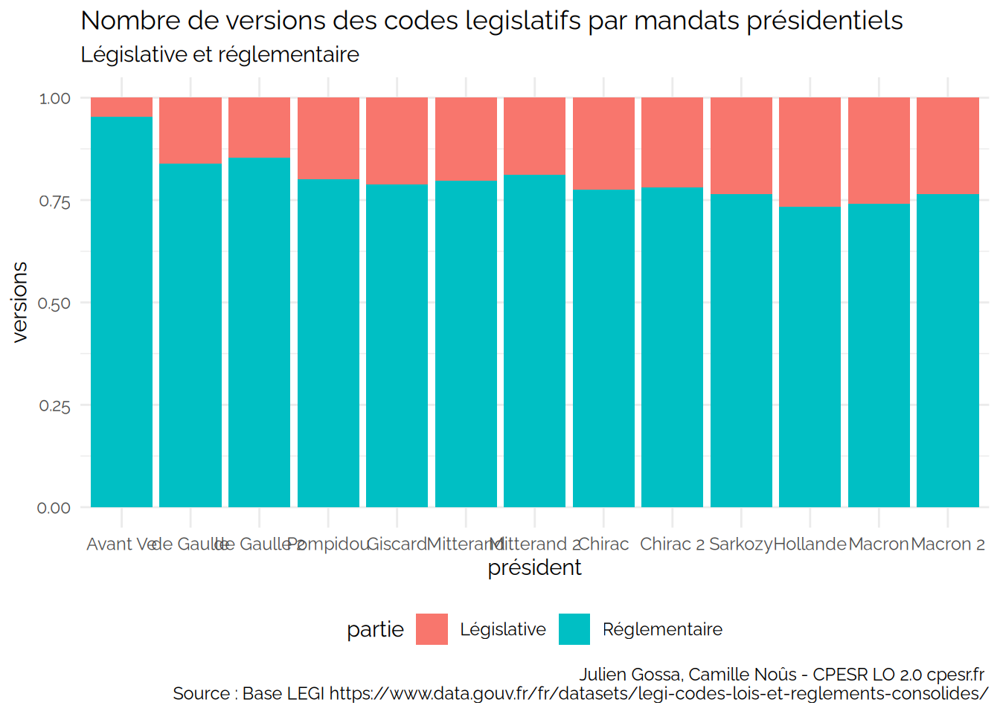

CPESR
================
CPESR
2025-10-01

## Versions

    ## [1] "code"      "num"       "etat"      "debut"     "fin"       "id"       
    ## [7] "partie"    "président"

[Télécharger les données](legifouille_files/figure-data/versions.csv)

[Télécharger les données](legifouille_files/figure-data/versions2.csv)

## Liens

- CITATION+cible = cite
- CITATION+source = cité par
- ABROGATION+cible = abrogé par

liste des natures ( 41 lignes)

| lien_typelien  | lien_sens | Nombre |
|:---------------|:----------|-------:|
| ABROGATION     | cible     |      2 |
| ABROGATION     | source    |  28160 |
| ABROGE         | cible     |  38932 |
| ANNULATION     | source    |    226 |
| CITATION       | cible     | 520878 |
| CITATION       | source    | 379614 |
| CODIFICATION   | cible     |      1 |
| CODIFICATION   | source    | 172448 |
| CODIFIE        | cible     |     12 |
| CODIFIE        | source    |      2 |
| CONCORDANCE    | cible     |  28103 |
| CONCORDANCE    | source    |  96462 |
| CONCORDE       | cible     |  32143 |
| CONCORDE       | source    |  17927 |
| CREATION       | cible     |      3 |
| CREATION       | source    |  46943 |
| CREE           | cible     |  76406 |
| DEPLACE        | cible     |   4631 |
| DEPLACEMENT    | source    |    146 |
| DISJOINT       | cible     |     17 |
| DISJOINT       | source    |      2 |
| DISJONCTION    | source    |     33 |
| HISTO          | source    |   1583 |
| MODIFICATION   | cible     |     10 |
| MODIFICATION   | source    |  95282 |
| MODIFIE        | cible     | 143572 |
| MODIFIE        | source    |      4 |
| PEREMPTION     | source    |   1133 |
| PERIME         | cible     |    517 |
| PILOTE_SUIVEUR | cible     |    819 |
| PILOTE_SUIVEUR | source    |    648 |
| RECTIFICATION  | source    |    527 |
| SPEC_APPLI     | cible     |   1889 |
| SPEC_APPLI     | source    |  18244 |
| TRANSFERE      | cible     |   5549 |
| TRANSFERT      | cible     |      2 |
| TRANSFERT      | source    |   3103 |
| TXT_ASSOCIE    | cible     |   2876 |
| TXT_ASSOCIE    | source    |   2524 |
| TXT_SOURCE     | cible     |  12827 |
| TXT_SOURCE     | source    |   3017 |

